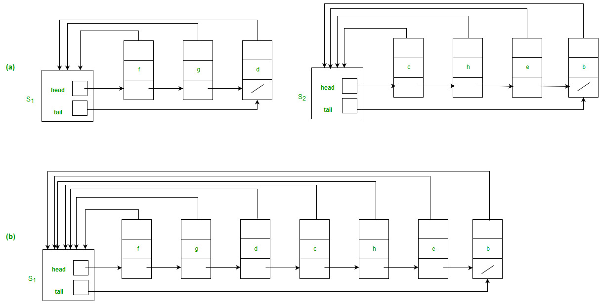

# Advanced DataStructure 

## Disjoint Set DataStructure

This Repository contains code for Disjoint Set Data structures. It has four folder which consists of following problems code

<h3 style="color: #007FFF;">1. MakeSet, Find and Union using linked lists</h3>
<h3 style="color: #007FFF;">2. Variation of 3 with tail pointer</h3>

<h3 style="color: #007FFF;">3. MakeSet, Find and Union using trees</h3>
<h3 style="color: #007FFF;">4. Variation using Path Compression</h3>
